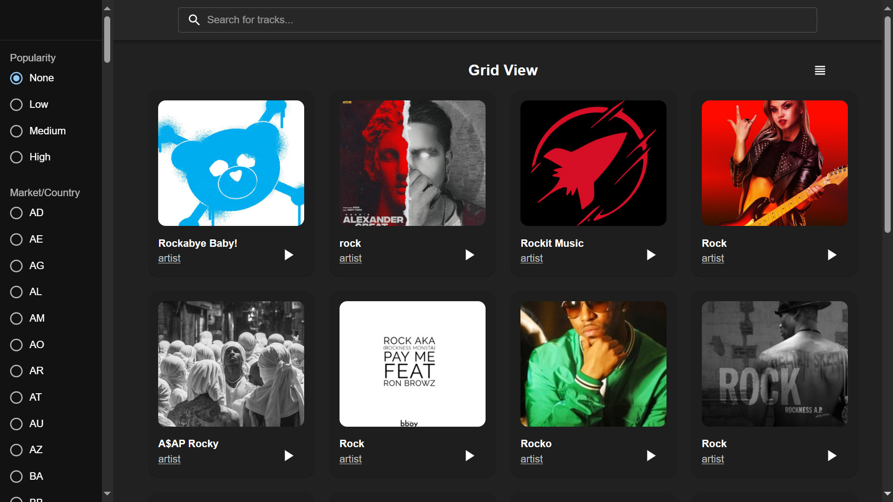
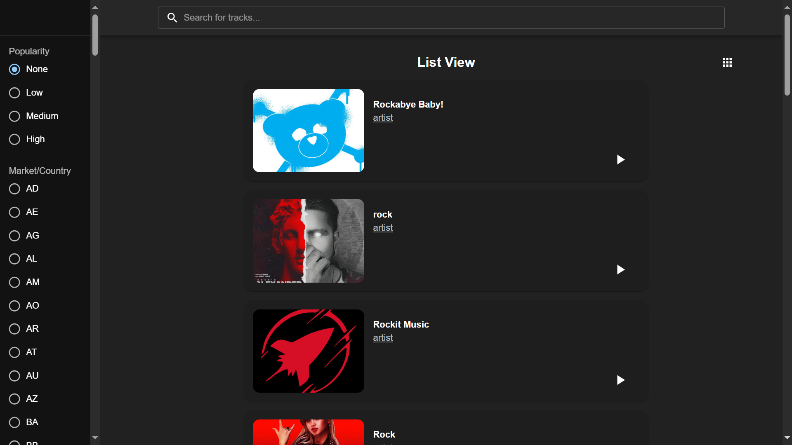
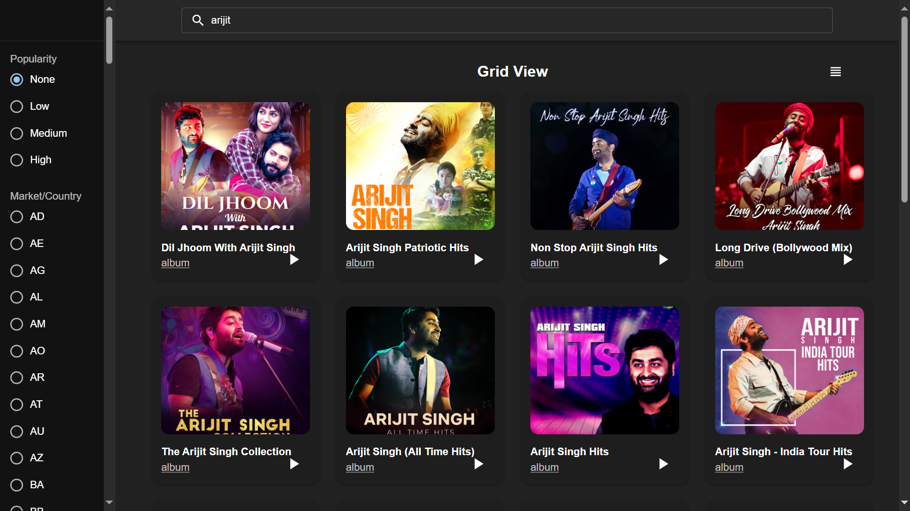
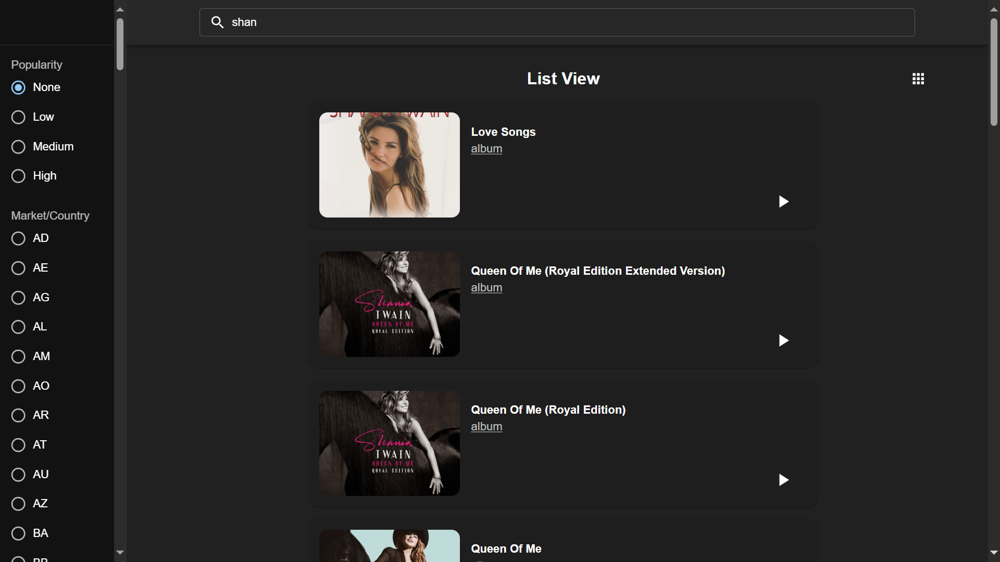

# Dash Spotify

🌐 Website : [dash-spotify](https://dash-spotify.vercel.app/)

## Default Grid View with ```q=rock``` parameter


## Default List View 


## Grid view with ```search=artist name```


## List view with ```search=artist name```



<br/>

# To run a React Vite app locally after pulling it from GitHub, follow these steps:

1. **Clone the Repository**: Open your terminal and navigate to the directory where you want to clone the repository. Then, run the following command to clone the repository:

   ```bash
   git clone <repository-url>
   ```

   Replace `<repository-url>` with the URL of the GitHub repository you want to clone.

2. **Navigate to the Project Directory**: Move into the directory of the cloned project:

   ```bash
   cd <project-directory>
   ```

   Replace `<project-directory>` with the name of the directory created by the clone operation.

3. **Install Dependencies**: Once you're inside the project directory, install the project dependencies using npm or yarn. Run one of the following commands:

   ```bash
   npm install
   # or
   npm i
   ```

4. **Start the Development Server**: After installing the dependencies, start the development server to run the React Vite app locally. Run the following command:

   ```bash
   npm run dev
   ```

   This command will start the development server and provide you with a local URL (usually `http://localhost:5173`) where you can view your React app.

5. **Access Your React App**: Open your web browser and navigate to the URL provided by the development server (e.g., `http://localhost:5173`). You should see your React Vite app running.

6. **Start Coding**: Now you can start coding your React app. Any changes you make to your code will automatically be reflected in the browser without the need to refresh the page, thanks to hot module replacement (HMR) provided by Vite.

7. **Build Your App for Production**: When you are ready to deploy your app, you can create a production build by running:

   ```bash
   npm run build
   ```

   This command will generate a production-ready build of your app in the `dist` directory.

That's it! You have successfully set up and run a React Vite app locally after pulling it from GitHub. You can now continue developing your app or deploy it to a hosting provider for production use.


# React + Vite

This template provides a minimal setup to get React working in Vite with HMR and some ESLint rules.

Currently, two official plugins are available:

- [@vitejs/plugin-react](https://github.com/vitejs/vite-plugin-react/blob/main/packages/plugin-react/README.md) uses [Babel](https://babeljs.io/) for Fast Refresh
- [@vitejs/plugin-react-swc](https://github.com/vitejs/vite-plugin-react-swc) uses [SWC](https://swc.rs/) for Fast Refresh
